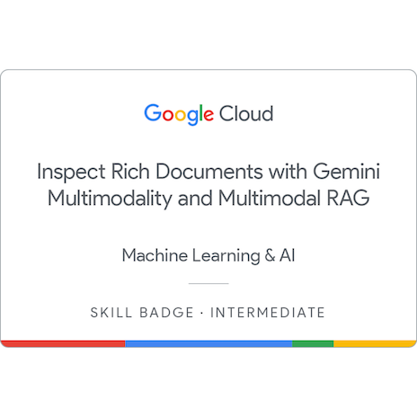

# Inspect Rich Documents with Gemini Multimodality & Multimodal RAG

## Basic Information

 Field  Details 
------------------
 **Title**  Inspect Rich Documents with Gemini Multimodality & Multimodal RAG 
 **Name**  Shreeyash Paraj 
 **Issuer**  Google Cloud 
 **Date Earned**  February 6, 2026 
 **Duration**  Intermediate Skill Badge 
 **Credential ID**  c5e0519b-f024-43d2-9dfa-b882b1e28f91 
 **Certificate Link**  https://www.credly.com/badges/c5e0519b-f024-43d2-9dfa-b882b1e28f91/public_url 
 **Certificate File**  `../assets/gemini-multimodality-multimodal-rag-inspect-rich-documents.png` 

---

## Skills Learned

- Multimodal AI
- Retrieval-Augmented Generation (RAG)
- Gemini Models
- Document Intelligence
- AI-Powered Search Systems
- Multimodal Prompt Engineering
- Knowledge Retrieval Systems
- Context-Aware AI Applications

---

## Description

The **Inspect Rich Documents with Gemini Multimodality & Multimodal RAG** skill badge validates intermediate-level expertise in building AI systems capable of understanding and extracting insights from rich, multimodal content.

The program focuses on leveraging Google's Gemini models to process and analyze multiple data modalities, including text, images, and structured documents. It also introduces Retrieval-Augmented Generation (RAG), enabling AI systems to combine external knowledge sources with Large Language Models to deliver more accurate and contextually relevant responses.

This badge demonstrates practical knowledge of modern AI architectures used in intelligent document processing, enterprise search, and knowledge management systems.

---

## Tools & Technologies

- Google Cloud Vertex AI
- Gemini Multimodal Models
- Retrieval-Augmented Generation (RAG)
- Large Language Models (LLMs)
- Document AI
- Knowledge Retrieval Systems
- Prompt Engineering

---

## Key Takeaways

- Developed an understanding of multimodal AI systems that process text and visual content simultaneously.
- Learned how Retrieval-Augmented Generation improves AI accuracy and contextual understanding.
- Gained hands-on experience using Gemini models for document analysis.
- Explored enterprise use cases involving document intelligence and knowledge retrieval.
- Learned best practices for designing AI systems that integrate external knowledge sources.
- Built foundational skills for developing next-generation AI-powered search and document processing applications.

---

## Topics Covered

### Multimodal AI

- Text and Image Understanding
- Rich Document Analysis
- Visual Information Extraction
- Multimodal Data Processing

### Gemini Models

- Gemini Multimodal Capabilities
- Context-Aware Reasoning
- Document Understanding
- Advanced AI Interactions

### Retrieval-Augmented Generation (RAG)

- RAG Architecture
- Knowledge Retrieval Pipelines
- Context Injection
- AI Search Systems

### Prompt Engineering

- Multimodal Prompt Design
- Context Optimization
- Query Enhancement
- Output Quality Improvement

### Vertex AI Workflows

- AI Model Integration
- Document Processing Solutions
- Enterprise AI Applications
- Generative AI Development

---

## Real-World Applications

- Enterprise Knowledge Management
- Intelligent Document Processing
- AI-Powered Search Engines
- Legal Document Analysis
- Research & Information Retrieval
- Business Intelligence Systems
- Multimodal AI Assistants
- Customer Support Knowledge Bases

---

## Industry Relevance

This skill badge demonstrates practical expertise in two of the most in-demand AI technologies:

- Multimodal Artificial Intelligence
- Retrieval-Augmented Generation (RAG)

These technologies are widely used in modern AI products, enterprise search platforms, intelligent assistants, and document understanding systems built on Large Language Models.

---

## Certificate Preview

  